I made a Digital Forensics CTF task named Micro:\
\
 
 
It is a .raw memory dump file so we will be analyzing it using volatility: \
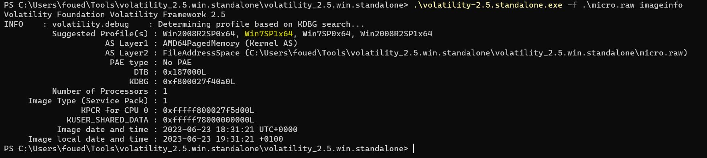\
 
 
The profile we will be using is Win7SP1x64 \
We will first be proceeding with a filescan and see what the desktop holds for us:\
We have two files that seemed to be interesting:\
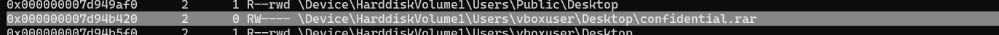\
 
 
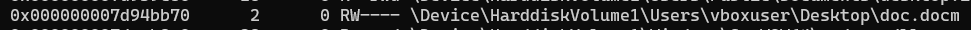\
 
 
Let's first download the two files and see what we have: \
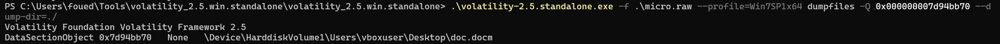\
 
 
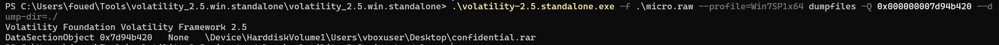\
 
 
We first unrar the confidential.rar file and we get this confidential.txt:\
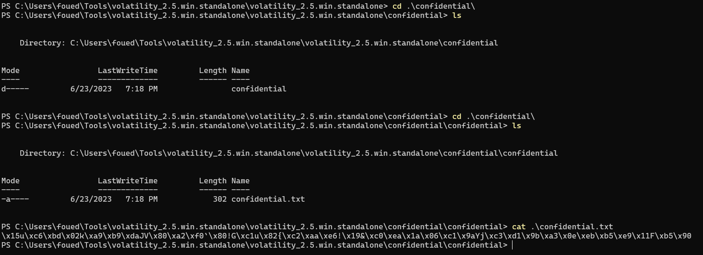\
 
 
This does not do us much right now, so let's go ahead and take a look at doc.docm file, which judging by the extension is a macro-enabled word document: \
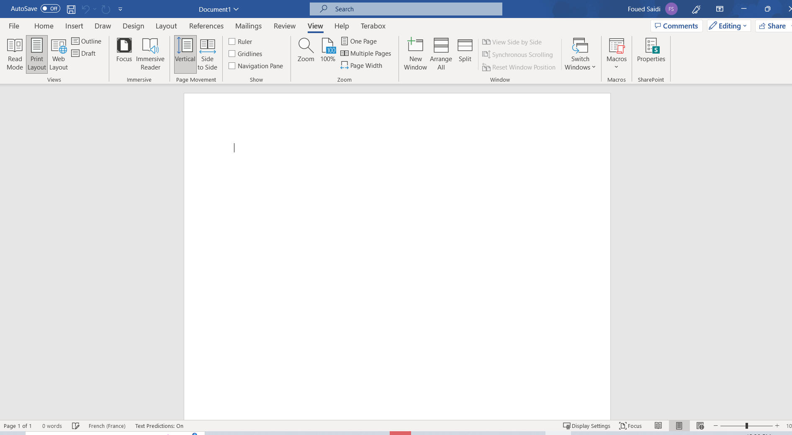\
 
 
But since this is a macro-enabled file, let's take a look at the macros:\
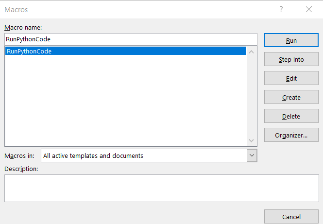\
 
 
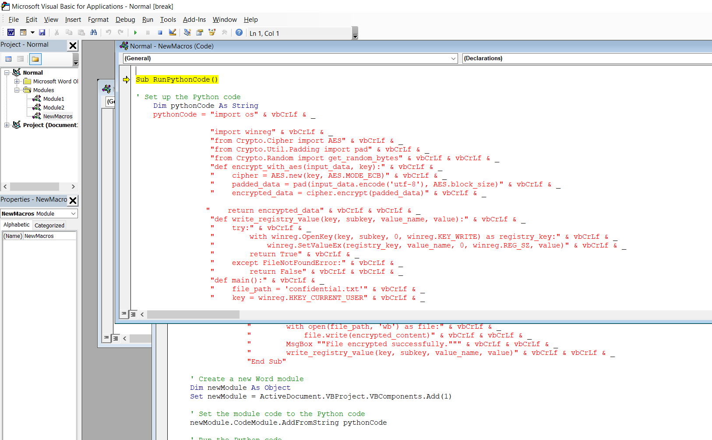\
 
 
We can see that we have some python code running inside the macro, so let's clean it up and see what this is:\
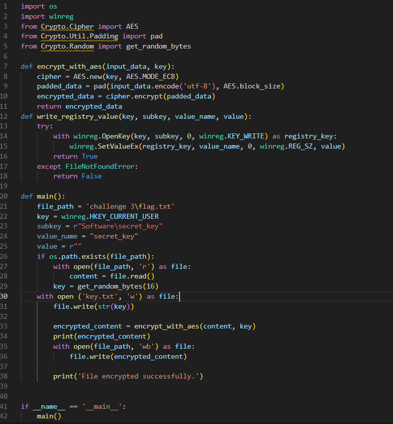\
 
 
After analyzing the code, we can see that this is basically a ransomware, it is using an AES algorithm, generate a random 16 byte key which we use for encryption, then stores the key in the Software hive under the name secret-key, so let's get that key:\
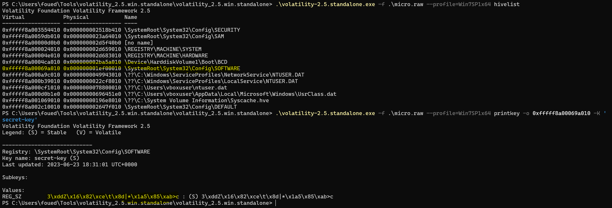\
 
 
And now we have the key and the confidential file, all we need to do now is to decrypt it, I prefer to write a decryptor script and not use tools but you may use Cyberchef: \
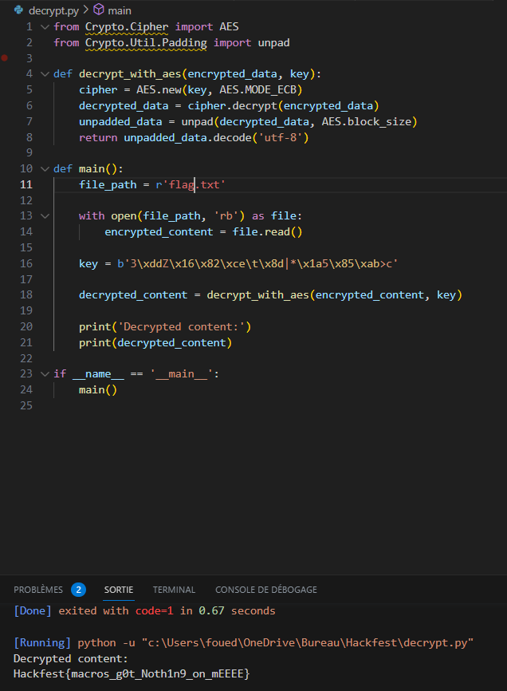\
 
 
And we get our flag: \ 
Hackfest{macros_g0t_Noth1n9_on_mEEEE}
