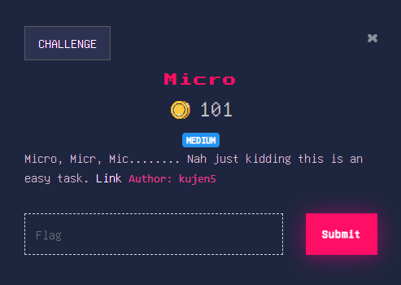

I made a Digital Forensics CTF task named Micro:\

It is a .raw memory dump file so we will be analyzing it using volatility: \

The profile we will be using is Win7SP1x64 \
We will first be proceeding with a filescan and see what the desktop holds for us:\
We have two files that seemed to be interesting:\

Let's first download the two files and see what we have: \

We first unrar the confidential.rar file and we get this confidential.txt:\

This does not do us much right now, so let's go ahead and take a look at doc.docm file, which judging by the extension is a macro-enabled word document: \

But since this is a macro-enabled file, let's take a look at the macros:\

We can see that we have some python code running inside the macro, so let's clean it up and see what this is:\
