I made a Digital Forensics challenges named ©Îu©M˜5œ0Á : 

 
 
It is a .raw memory dump file so we will be analyzing it using volatility: \
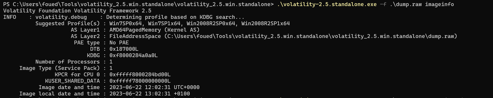
 
 
The profile we will be using is Win7SP1x64 \
We will first be proceeding with a filescan and see what the desktop holds for us:\
We have two files that seemed to be interesting:\
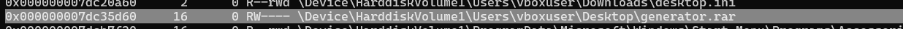
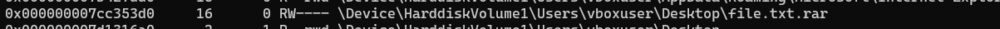
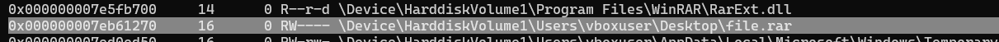
 
 
Let's first download the files and see what we have: \
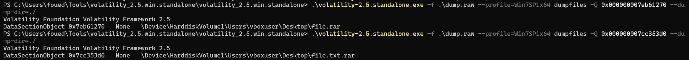
 
 
Checking the contents of generator.rar we see that it holds an executable file: \
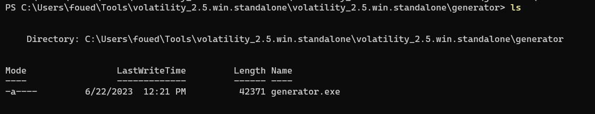
 
 
Opening it with Ghidra we see that this is an AES algorithm generating a combination of an IV and KEY and then stores them in dessktop.ini and deesktop.ini files: \ 
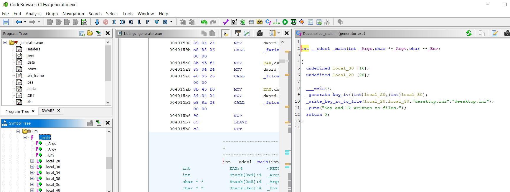
 
 
So we get those two files and take a look: \ 
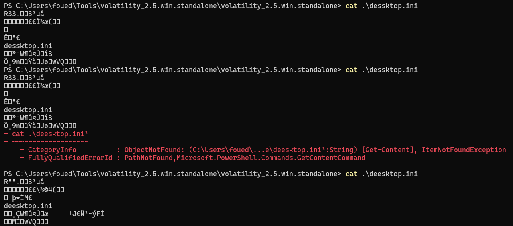
 
 
They seem a bit weird, like their header is messed up, after taking some time to think, these are RAR files which the header is messed up so we fix the headers making them ``52 61 72 21`` and we check the contents: \
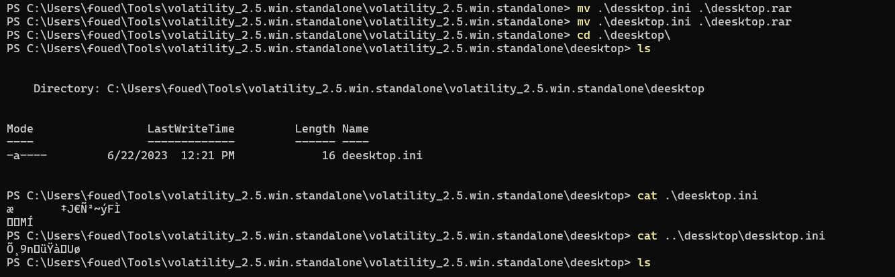
 
 
And this way we get the values for the IV and KEY. \
Then let's take a look at the file.rar's contents: \
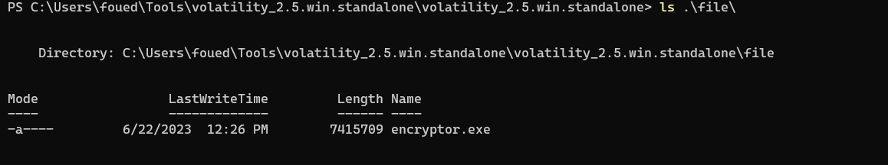
 
 
We can see that this is an executable file. After some research, we found that this is an exe file generated from a .py file due to the existence of the pyinstaller library, so let's break it down first using the pyinstxtractor tool from github: \
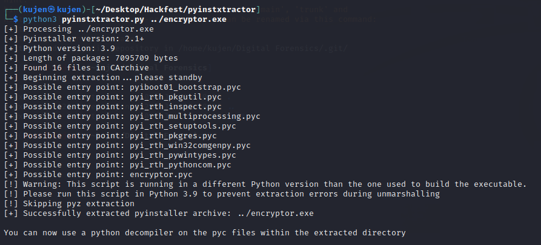
 
 
This gives us a .pyc python-compiled byte code, let's break it down using the pycdc tool from github to get the source code: \
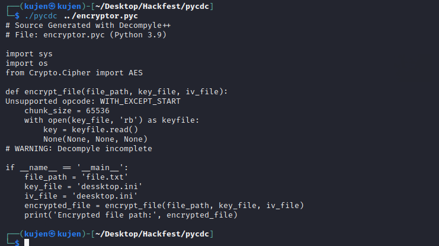
 
 
From all the information we have above, and having the key, IV, and the encrypted flag ``file.txt.enc`` we can now write our decryptor file (you can also use an online tool like Cyberchef): \
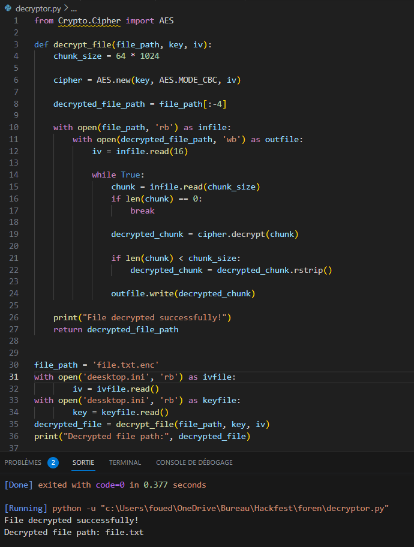
 
 
And we get our flag: \
``Hackfest{y0u_truly-4re_4-f0rensic5_1nvest1gat0r}``
